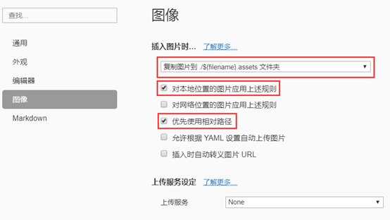
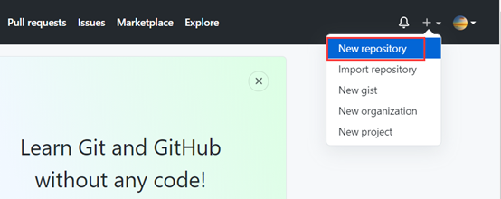
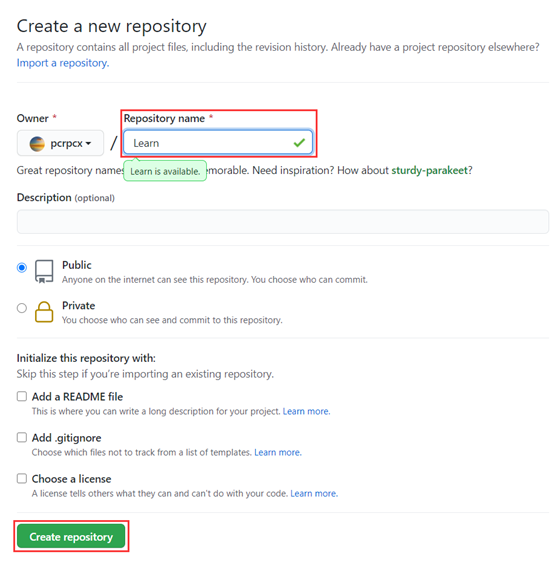
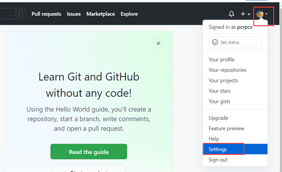
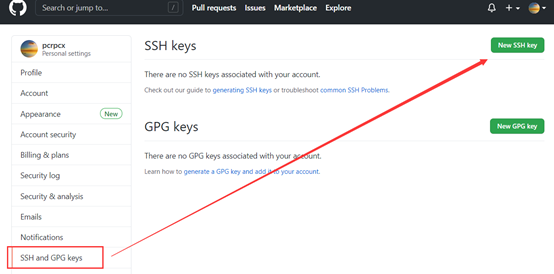
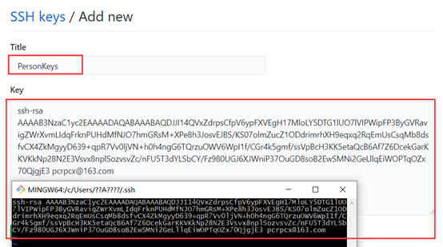
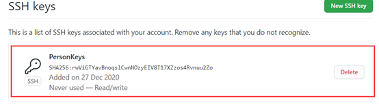

Typora编写markdown非常方便，再加上使用git将文章推送到GitHub。

1、下载并安装Typora

官网地址：https://www.typora.io/

2、创建GitHub并建议自己的仓库

官网地址：https://github.com/

3、下载git for windows

官网地址：https://gitforwindows.org/

注：本人使用环境为Windows，其他系统类似。安装只需要Next即可，这里不做介绍。

开始教程

一、打开Typora上传图片功能

选择“文件”--“偏好设置”，再按图进行修改即可。

二、创建GitHub仓库

三、打开git bash并进行配置

1、配置用户名

$ git config --global user.name "username"

2、配置用户邮箱

$ git config --global user.email "username@gihub.com"

3、在git终端配置ssh key

$ ssh-keygen -t rsa -C "username@gihub.com"

之后一路回车，完成后进入.ssh目录（一般在c:\Users\个人账户\\.ssh目录）

4、登录GitHub并将id_rsa.pub内容复制即可

注：之后就可以愉快的写文档了

四、GitHub使用说明

1、克隆GitHub项目到本地

1）使用HTTPS方式

$ git clone https://github.com/username/Learn.git

2）使用SSH方式

$ git clone git@github.com:username/Learn.git

2、将本地文件git到GitHub远程仓库

1）编写本地文件或项目

如：在D盘创建一个GitHub本地仓库，并写一个项目

2）初始化版本库

$ git init

3）配置远程仓库名称

$ git remote add origin git@github.com:username/Learn.git

注：之后如果不想连接此远程仓库，可使用以下命令：

​        $ git remote remove origin

4）查看配置

$ git remote -v

push：表示把代码推送到远程仓库

fetch：表示把代码从远程仓库取回

5）将修改的文件添加到暂存区

$ git add Typora and Github.md  #提交Typora and Github.md文件到暂存区

$ git add -A  #提交所有变化到暂存区

6）提交文档

$ git commit -m "typora and github"  #相当于添加一个注释

$ git commit --amend -m "new github"  #如果修改注释错误，可使用此命令进行修改

7）推送文件到远程仓库

$ git push -u origin master  # 